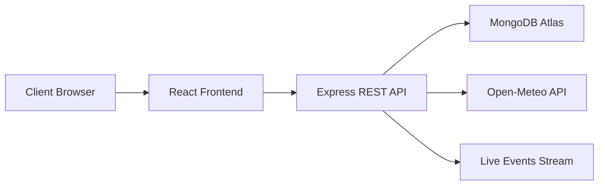

# QuickBite Restaurant Ordering System

QuickBite is a multitier restaurant menu and ordering management project. It demonstrates a React presentation layer, an Express application/API layer, and a MongoDB data layer.

## Features

- Responsive restaurant menu UI
- Categories: Meals, Soups, Desserts, Drinks
- Admin menu management: create, edit, delete
- User registration, login, logout
- Password reset endpoint
- Role-based access: admin and customer
- JWT-style token authentication
- MongoDB persistence with Mongoose models
- Filtering, sorting and pagination for foods
- Seed data for demo products
- Open-Meteo third-party API integration
- Real-time live menu notifications with Server-Sent Events
- Analytics endpoint for menu totals and average price
- Request logging and simple rate limiting

## Architecture



## Technology Stack

- Frontend: React, Vite, Axios
- Backend: Node.js, Express
- Database: MongoDB Atlas, Mongoose
- External API: Open-Meteo
- Real-time: Server-Sent Events

## Setup

### Backend

```powershell
cd "C:\Users\Aymen\Desktop\QuickBite\quickbite\backend"
npm install
```

Create `.env`:

```env
PORT=5000
MONGO_URI=your_mongodb_connection_string
JWT_SECRET=quickbite-demo-secret
```

Seed demo foods:

```powershell
node seed.js
node create-admin.js
npm run dev
```

Admin login:

```text
Email: admin
Password: admin
```

### Frontend

```powershell
cd "C:\Users\Aymen\Desktop\QuickBite\quickbite\frontend"
npm install
npm run dev
```

Open:

```text
http://localhost:5173
```

## User Guide

- Customers can register, log in and browse the restaurant menu.
- Admin can log in with `admin / admin`.
- Admin can add, edit and delete menu products.
- Category buttons filter menu items by type.
- Analytics cards show live menu statistics.
- Weather card uses Open-Meteo as a third-party API integration.
- Live notifications appear when menu items are changed.

## Requirements Coverage

- Multitier architecture: React, Express, MongoDB
- Authentication and authorization: register, login, logout, password reset, role-based admin access
- Business logic: menu CRUD, validation, error handling
- Data management: MongoDB persistence, seeding, filtering, sorting, pagination
- UI: responsive restaurant interface
- Integration: Open-Meteo API
- - Security/performance: password hashing, token auth, rate limiting, logging
- Real-time: Server-Sent Events notifications
- Documentation: README, API docs, architecture diagram
- Security/performance: password hashing, token auth, rate limiting, logging
- Real-time: Server-Sent Events notifications
- Documentation: README, API docs, architecture diagram
